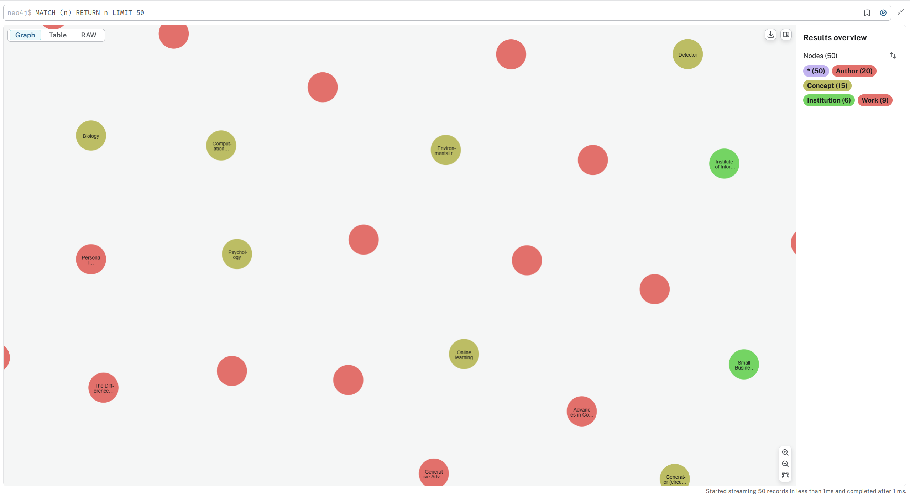
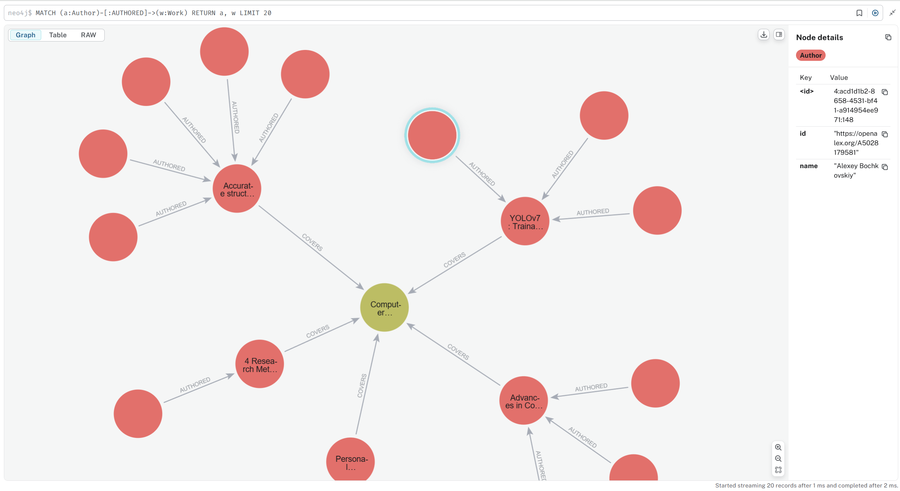
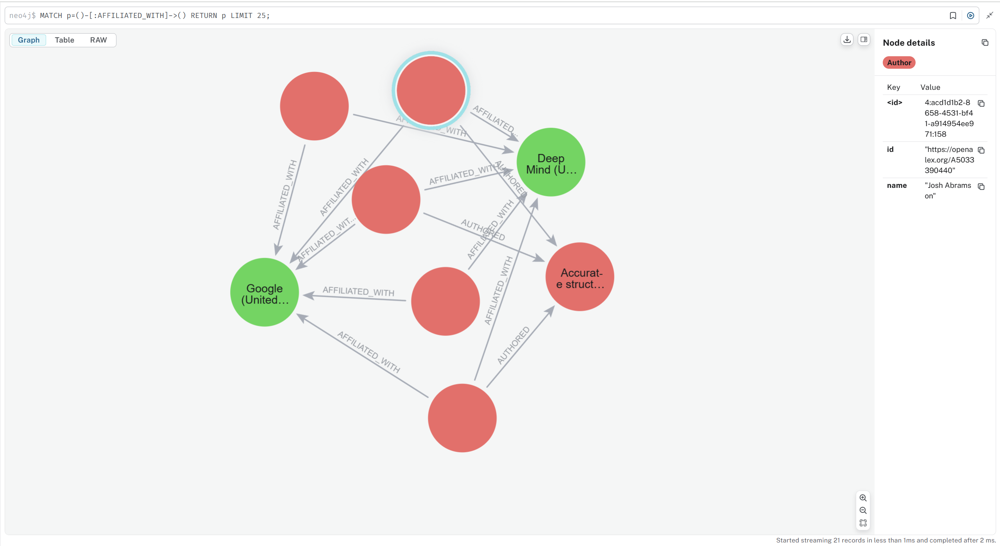
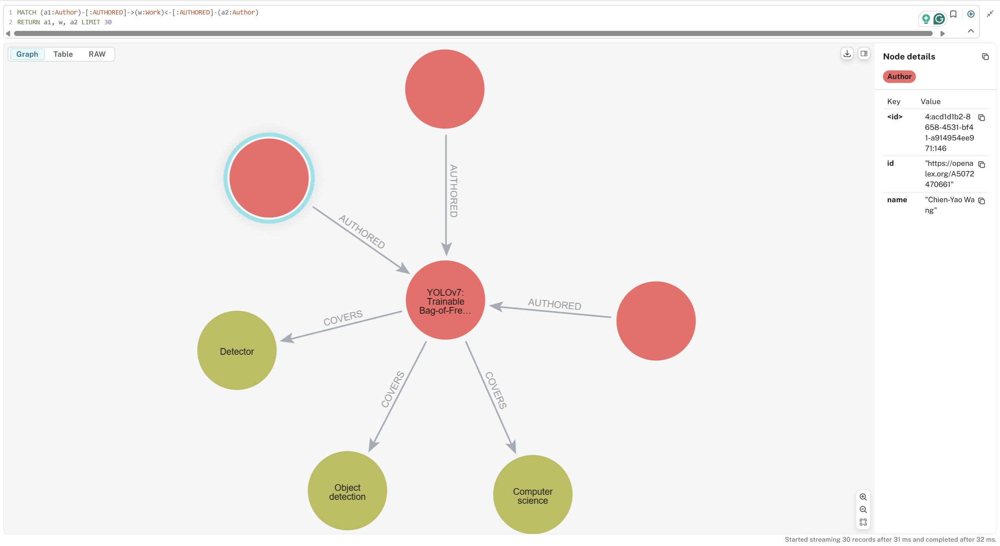

# Neo4j Task

Simple script to explore OpenAlex academic data using Neo4j graph database.

## Project Setup

### Neo4j Setup
1. Download and install [Neo4j Desktop](https://neo4j.com/download/)
2. Create a new database project
3. Set database credentials: `username=neo4j, password=password`
4. Start the database instance

### Requirements
```bash
pip install py2neo requests
```

### Run the Project
```bash
python neo4j_task.py
```

## What it does
- Fetches recent Computer Science papers from OpenAlex API
- Creates nodes for Authors, Works, Institutions, and Concepts
- Builds relationships between them
- Runs basic analysis queries

## View Results
1. Open Neo4j Browser at http://localhost:7474
2. Login with your credentials
3. Run the example queries below

### 1. Overview of the Graph
```cypher
MATCH (n) RETURN n LIMIT 50
```
**Graph for all entities and their connections (Zoomed in)**



### 2. Author-work Relationships
```cypher
MATCH (a:Author)-[:AUTHORED]->(w:Work) RETURN a, w LIMIT 20
```
**Displays who authored which research papers (Zoomed in)**



### 3. Author Affiliation
```cypher
MATCH p=()-[:AFFILIATED_WITH]->() RETURN p LIMIT 25;
```
**Shows affiliations of authors**



### 4. Research Collaboration Network
```cypher
MATCH (a1:Author)-[:AUTHORED]->(w:Work)<-[:AUTHORED]-(a2:Author)
RETURN a1, w, a2 LIMIT 30
```
**Shows collaboration between researchers**

